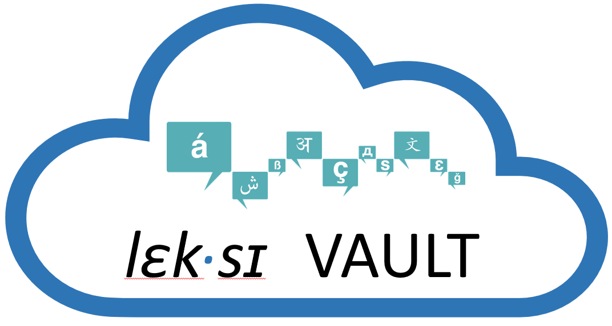

# Welcome to [LexiVault](https://lexivault.streamlit.app)
  
Lexivault is a repository and [**web-tool**](https://lexivault.streamlit.app) for psycholinguistic lexicons of lesser-studied languages.  
The development of this tool falls within a wider research context studying the **S**ystematicity **a**nd **V**ariation in Word Structure Processing **A**cross Languages through a **N**euro-**T**ypology Approach, a.k.a. The [SAVANT](https://savant.qmul.ac.uk/) Project.

## About
Investigating psycholinguistic questions relies on fine-grained, corpus-derived measures. Psycholinguistic research is hampered by lack of computational resources for most of the world’s languages.
Existing resources fall short of fully satisfying desired requirements for:
- Accessibility
- Broad language support for psycholinguistic research 
- Minimizing resource building efforts

**Current goal:** Build and collect resources that are structured for psycholinguistic inquiry of lesser-studied languages
So we set up a baseline process and structure to follow as we build each of the language resources on our docket and beyond for eventual contributors to keep enriching LexiVault while still following a set of guidelines to keep the data relevant for psycholinguistic research, namely:
- A sufficiently representative corpus in size and content to support significance of findings, and specific measures typically used in psycholinguistic studies, such as normalized frequencies, transition probabilities, and grapheme-to-phoneme transcription which typically doesn’t co-occur with morphological or lexical annotation in a same resource 
- But still with a flexible enough format to accommodate a diverse range of lesser-resourced languages in terms of bare-bones universal features like word tokens and their frequencies, or for instance using IPA to represent phonetic information and the option to extend certain datasets to add language-specific attributes like roots and patterns for semitic languages

## Citation
If you find LexiVault useful in your research, please cite [this paper](https://lrec-coling-2024.org/list-of-accepted-papers/):
```bibtex
@inproceedings{saddiki-etal-2024-lexivault,
	title        = {LexiVault: A repository for psycholinguistic lexicons of lesser-studied languages},
	author       = {Saddiki, Hind and 
			Wray, Samantha and 
			Li, Daisy
			},
	year         = 2024,
	month        = may,
	booktitle    = {Proceedings of the 14th Language Resources and Evaluation Conference},
	publisher    = {European Language Resources Association},
	address      = {Torino, Italia},
	pages        = {},
	isbn         = {},
	url          = {},
	abstract     = {This paper presents LexiVault, an open-source web tool with annotated lexicons and rich retrieval capabilities primarily developed for, but not restricted to, the support of psycholinguistic research with key measures to design stimuli for low-resource languages. Psycholinguistic research relies on human responses to carefully crafted stimuli for a better understanding of the mechanisms by which we learn, store and process language. Stimuli design captures specific language properties such as frequency, morphological complexity, or stem likelihood in a part of speech, typically derived from a corpus that is representative of the average speaker’s linguistic experience. These measures are more readily available for well-resourced languages, whereas efforts for lesser-studied languages come with substantial overhead for the researcher to build corpora and calculate these measures from scratch. This stumbling block widens the gap, further skewing our modeling of the mental architecture of linguistic processing towards a small, over-represented set of the world’s languages. To lessen this burden, we designed LexiVault to be user friendly and accommodate incremental growth of new and existing low-resource language lexicons in the system through moderated community contributions while abstracting programming complexity to foster more interest from the psycholinguistics community in exploring low-resource languages.},
	language     = {English},
	pubstate     = {forthcoming}
}
```
